# Computer Networks
## Computer Assignment 2

In this assignment we are about to build a wireless topology containing 3 sender, 3 receivers, and 1 load balancer.

Sender sand data to load balancer, and load balancer sends data to receivers.

Sender connects to load balancer using UDP, and load balancer connects to receivers using TCP.

### Topology

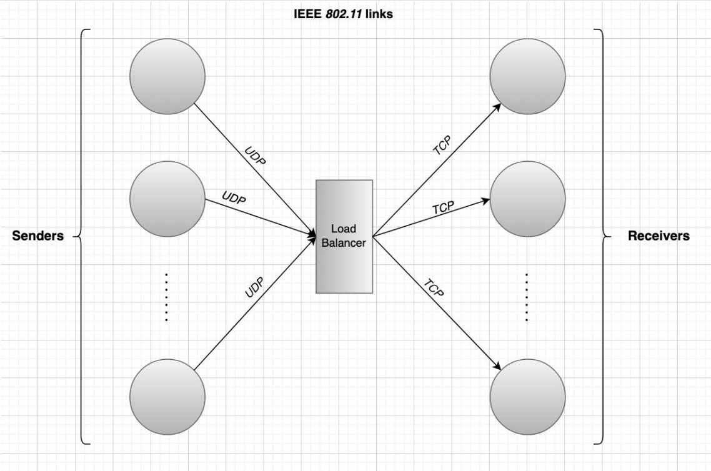

We will test this topology with 1Mbps, 10Mbps, and 100Mbps bandwidth and with error rate of
0.0%, 0.000001%, 0.00001%, 0.0001%, and 0.001%.

We expect higher throughput with higher bandwidth and lower throughput with more error rate.

Our load balancer uses a queue to store data from senders, and it sends data to receivers using TCP.

We randomly select a receiver to send data to and dequeue data from queue. We also apply the error rate to data before
sending it to receiver. If the data packed should be dropped we ignore the packed and not send to receiver.

### How to run

*Unfortunately I was not able to make ns3 visualization working, so we only stick to raw data generated*

place `main.cc` file under `scratch` directory and enter command below.

**3.35:**

```bash
./waf --run scratch/main
```

**3.37:**

```bash
./ns3 run scratch/main
```

### Sample Run

```
Flow ID                 : 1 ; 10.1.1.1 -----> 10.1.1.2
Tx Packets = 72509
Rx Packets = 68480
Duration                : 8.99986
Last Received Packet    : 9.99999 Seconds
Throughput: 31.3481 Mbps
---------------------------------------------------------------------------
Flow ID                 : 2 ; 10.1.2.1 -----> 10.1.2.2
Tx Packets = 71704
Rx Packets = 67719
Duration                : 8.89987
Last Received Packet    : 9.99999 Seconds
Throughput: 31.3481 Mbps
---------------------------------------------------------------------------
Flow ID                 : 3 ; 10.1.3.1 -----> 10.1.3.2
Tx Packets = 70898
Rx Packets = 66957
Duration                : 8.79975
Last Received Packet    : 9.99987 Seconds
Throughput: 31.348 Mbps
---------------------------------------------------------------------------
Flow ID                 : 4 ; 10.1.4.1 -----> 10.1.4.2
Tx Packets = 2
Rx Packets = 2
Duration                : 3.00201
Last Received Packet    : 4.30201 Seconds
Throughput: 0.00028464 Mbps
---------------------------------------------------------------------------
Flow ID                 : 5 ; 10.1.5.1 -----> 10.1.5.2
Tx Packets = 2
Rx Packets = 2
Duration                : 3.00201
Last Received Packet    : 4.30201 Seconds
Throughput: 0.00028464 Mbps
---------------------------------------------------------------------------
Flow ID                 : 6 ; 10.1.6.1 -----> 10.1.6.2
Tx Packets = 2
Rx Packets = 2
Duration                : 3.00201
Last Received Packet    : 4.30201 Seconds
Throughput: 0.00028464 Mbps
---------------------------------------------------------------------------
Flow ID                 : 7 ; 10.1.4.2 -----> 10.1.4.1
Tx Packets = 2
Rx Packets = 2
Duration                : 3.00201
Last Received Packet    : 4.30402 Seconds
Throughput: 0.000203314 Mbps
---------------------------------------------------------------------------
Flow ID                 : 8 ; 10.1.5.2 -----> 10.1.5.1
Tx Packets = 2
Rx Packets = 2
Duration                : 3.00201
Last Received Packet    : 4.30402 Seconds
Throughput: 0.000203314 Mbps
---------------------------------------------------------------------------
Flow ID                 : 9 ; 10.1.6.2 -----> 10.1.6.1
Tx Packets = 2
Rx Packets = 2
Duration                : 3.00201
Last Received Packet    : 4.30402 Seconds
Throughput: 0.000203314 Mbps
---------------------------------------------------------------------------
```

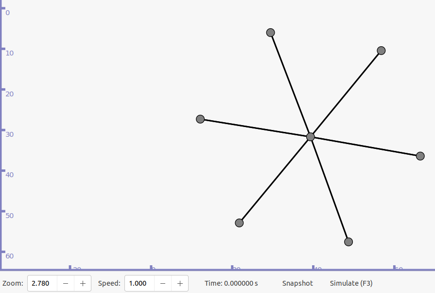

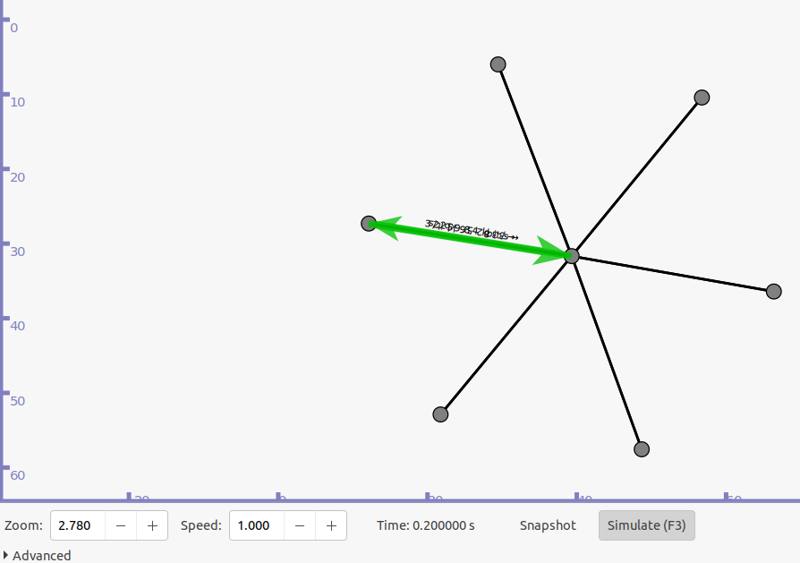

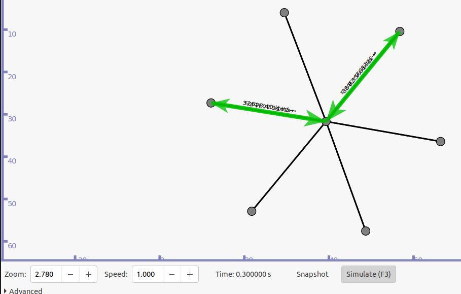

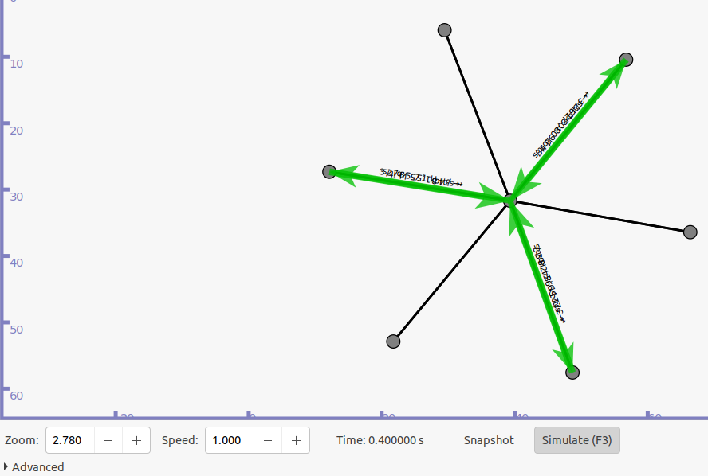

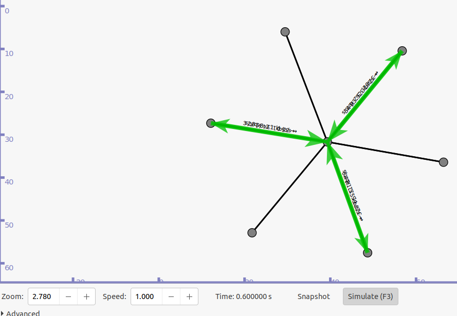

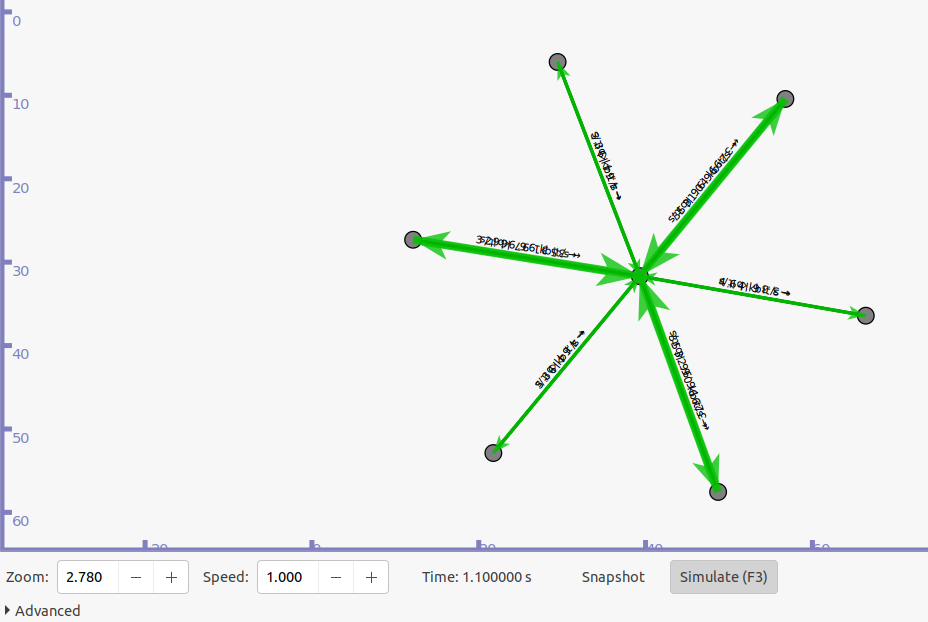

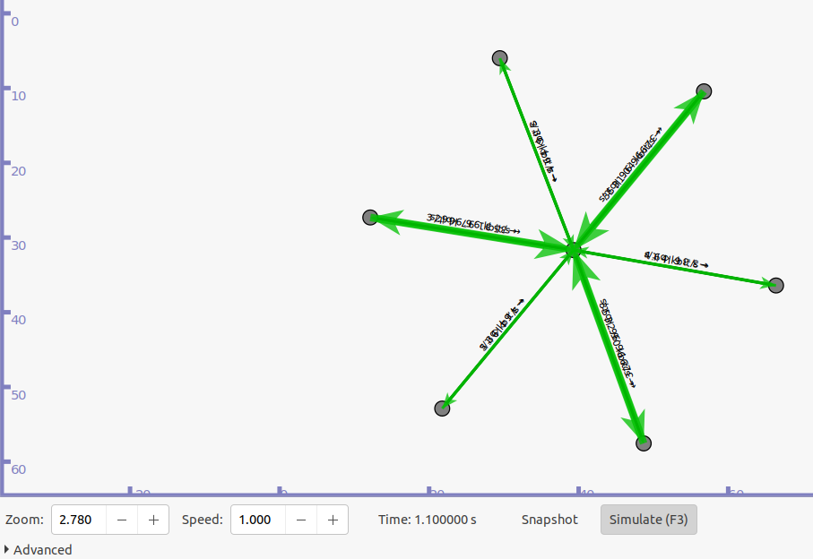

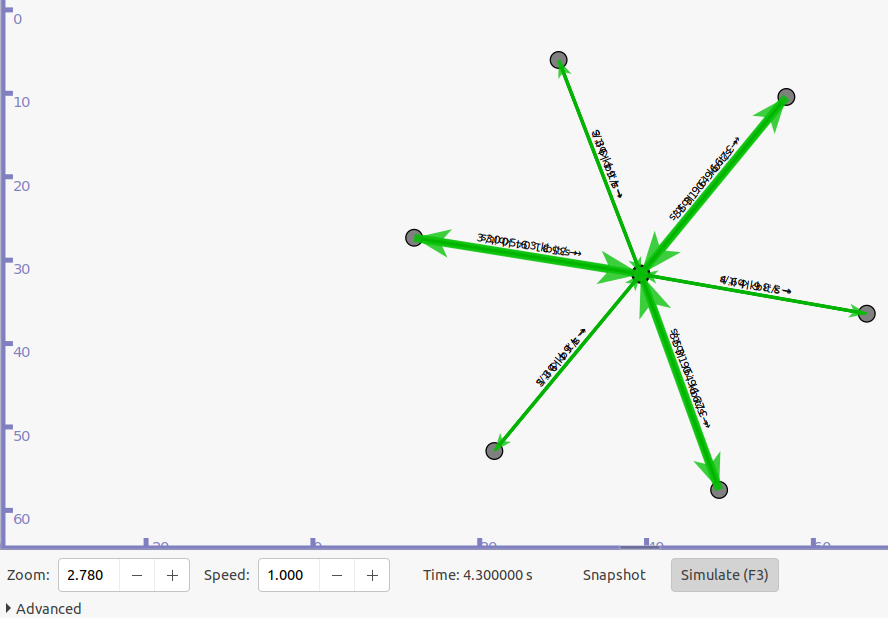

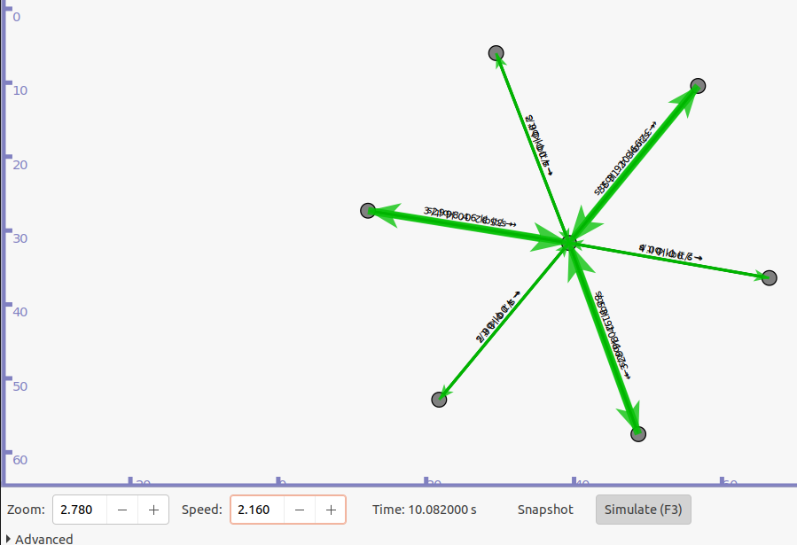

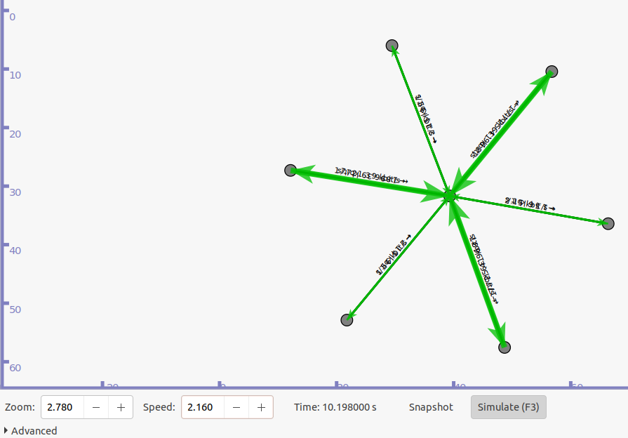

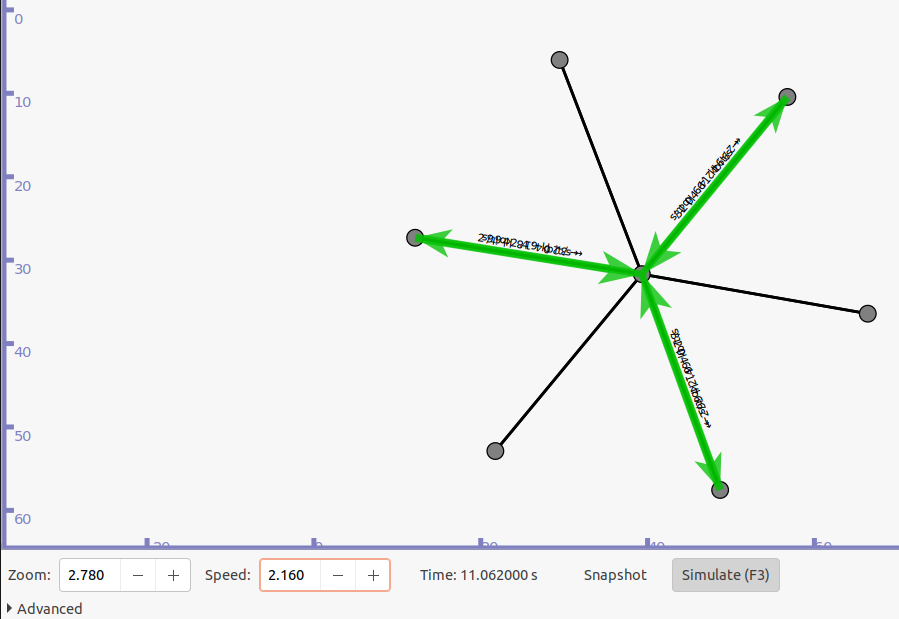

### Code Explanation

```c++
NodeContainer network;
network.Create(senders_count + receivers_count + 1);
NodeContainer sender1 = NodeContainer(network.Get(0), network.Get(6));
NodeContainer sender2 = NodeContainer(network.Get(1), network.Get(6));
NodeContainer sender3 = NodeContainer(network.Get(2), network.Get(6));

NodeContainer receiver1 = NodeContainer(network.Get(6), network.Get(3));
NodeContainer receiver2 = NodeContainer(network.Get(6), network.Get(4));
NodeContainer receiver3 = NodeContainer(network.Get(6), network.Get(5));
```
Here we build our network, we create 7 nodes, 3 senders, 3 receivers, and 1 load balancer.
Then define connections between nodes.

```c++
NetDeviceContainer sender1_device = p2p.Install(sender1);
NetDeviceContainer sender2_device = p2p.Install(sender2);
NetDeviceContainer sender3_device = p2p.Install(sender3);

NetDeviceContainer receiver1_device = p2p.Install(receiver1);
NetDeviceContainer receiver2_device = p2p.Install(receiver2);
NetDeviceContainer receiver3_device = p2p.Install(receiver3);
```
Here we make each node a device that can have ip address and can send and receive data.


```c++
Ipv4AddressHelper ipv4;
ipv4.SetBase("10.1.1.0", "255.255.255.0");
Ipv4InterfaceContainer sender1_ip = ipv4.Assign(sender1_device);

ipv4.SetBase("10.1.2.0", "255.255.255.0");
Ipv4InterfaceContainer sender2_ip = ipv4.Assign(sender2_device);

ipv4.SetBase("10.1.3.0", "255.255.255.0");
Ipv4InterfaceContainer sender3_ip = ipv4.Assign(sender3_device);

ipv4.SetBase("10.1.4.0", "255.255.255.0");
Ipv4InterfaceContainer receiver1_ip = ipv4.Assign(receiver1_device);

ipv4.SetBase("10.1.5.0", "255.255.255.0");
Ipv4InterfaceContainer receiver2_ip = ipv4.Assign(receiver2_device);

ipv4.SetBase("10.1.6.0", "255.255.255.0");
Ipv4InterfaceContainer receiver3_ip = ipv4.Assign(receiver3_device);

Ipv4GlobalRoutingHelper::PopulateRoutingTables();
```
In this part we assign ip address to each node, and populate routing table.


```c++
uint16_t inboud_port = 9;

OnOffHelper onOffHelper_sender("ns3::UdpSocketFactory",Address(InetSocketAddress(sender1_ip.GetAddress(1), inboud_port)));
onOffHelper_sender.SetConstantRate(DataRate(data_rate));
ApplicationContainer application_sender = onOffHelper_sender.Install(network.Get(0));
application_sender.Start(Seconds(1.0));
application_sender.Stop(Seconds(10.0));

onOffHelper_sender.SetAttribute("Remote", AddressValue(InetSocketAddress(sender2_ip.GetAddress(1), inboud_port)));
application_sender = onOffHelper_sender.Install(network.Get(1));
application_sender.Start(Seconds(1.1));
application_sender.Stop(Seconds(10.0));

onOffHelper_sender.SetAttribute("Remote", AddressValue(InetSocketAddress(sender3_ip.GetAddress(1), inboud_port)));
application_sender = onOffHelper_sender.Install(network.Get(2));
application_sender.Start(Seconds(1.2));
application_sender.Stop(Seconds(10.0));
```
Now senders are ready to send data to load balancer, we use onOffHelper to send data with a constant rate.

```c++
queue<uint32_t> inbound_data;
for (int i = 0; i < packet_size; ++i) { inbound_data.push(i); }

vector<uint32_t> outbound_data1;
vector<uint32_t> outbound_data2;
vector<uint32_t> outbound_data3;

while (!inbound_data.empty()) {
    int error = rand() % error_rate;
    if (error == 0) {
        inbound_data.pop();
        continue;
    }

    int choice = (rand() % 3) + 1;
    switch (choice) {
    case 1:
        outbound_data1.push_back(inbound_data.front());
        break;
    case 2:
        outbound_data2.push_back(inbound_data.front());
        break;
    case 3:
        outbound_data3.push_back(inbound_data.front());
        break;
    }
}
```
This is load balancer implementation. As discussed earlier, we use random number generator to choose which receiver
to send data to.

Before that we check probability of error, if error happens we drop the packet.

```c++
OnOffHelper onOffHelper_receiver("ns3::TcpSocketFactory", Address(InetSocketAddress(receiver1_ip.GetAddress(1), outbound_port)));
onOffHelper_receiver.SetConstantRate(DataRate(data_rate));

ApplicationContainer application_receiver = onOffHelper_receiver.Install(network.Get(6));
application_receiver.Start(Seconds(1.3));
application_receiver.Stop(Seconds(10));

onOffHelper_receiver.SetAttribute("Remote", AddressValue(InetSocketAddress(receiver2_ip.GetAddress(1), outbound_port)));

application_receiver = onOffHelper_receiver.Install(network.Get(6));
application_receiver.Start(Seconds(1.3));
application_receiver.Stop(Seconds(10));

onOffHelper_receiver.SetAttribute("Remote", AddressValue(InetSocketAddress(receiver3_ip.GetAddress(1), outbound_port)));

application_receiver = onOffHelper_receiver.Install(network.Get(6));
application_receiver.Start(Seconds(1.3));
application_receiver.Stop(Seconds(10));
```
In this part load balancer send data to receivers, we use onOffHelper to send data with a constant rate.


<!---I hate this project
My teammate left me empty-handed--->
